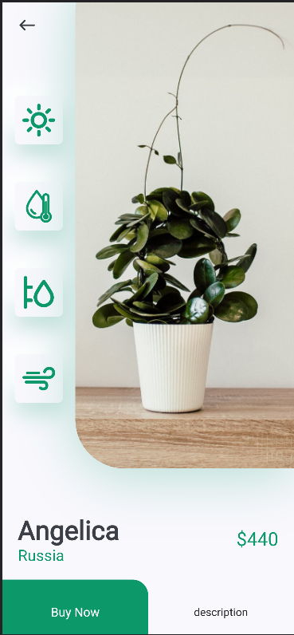

# PlantApp

# Description
### Nice clean plant app UI using flutter, the Home page you will get search box than a horizontal list of recommended plants. At the bottom featured plans list. On the details page, a big image with its 4 icons on the right side also add to the cart button.

# Tools 
### Flutter
### Dart PL

# Project Structure
### The application consist of five screens:
## 1) Home Page

## 2) Detail Page

## 3) Description Page

## 4) Sidebar

## 5) Contact information page

## Contact person
##### Name: Aiana
##### Surname: Diushenalieva
##### email: aiana.diushenalieva@iaau.edu.kg
##### phone: +996999251530

